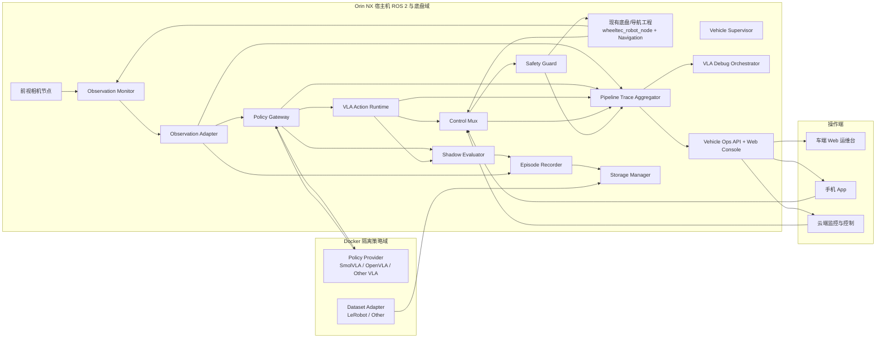
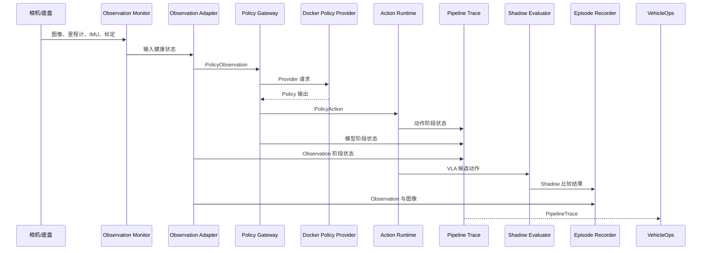

# VLA 车辆平台总体方案设计

## 1. 文档定位

本文档描述基于 Jetson Orin NX 的阿克曼小车 VLA 车辆平台总体设计，覆盖当前已经实现的 ROS 2 节点、Docker 推理运行时、Vehicle Ops 运维控制台、Episode 数据链路，以及未来接入其他 VLA、手机临时接管和云端监控控制的演进方向。

本文档的核心原则是：

- 平台能力与具体模型解耦；
- 原有 `rhzd_assist`、`wheeltec_ros2` 和导航工程保持独立；
- 新平台通过 ROS 2 接口与底盘、导航和传感器系统协作；
- VLA 只能通过标准 Policy 接口进入控制链路，不能直接发布最终底盘指令；
- 所有控制请求必须经过控制仲裁、安全门和权限校验；
- 数据采集格式模型无关，模型专用格式通过 Adapter 转换；
- 网页、手机 App、云端控制统一进入同一个操作和权限边界；
- 调试、Shadow、实车控制和生产部署分阶段隔离。

## 2. 建设目标

### 2.1 当前目标

当前阶段首先建立一套可在 Orin NX 上运行、调试和验证的 VLA 平台骨架：

1. 接入单前视相机和车辆状态；
2. 形成统一 Observation 数据契约；
3. 通过 Docker 隔离 LeRobot/SmolVLA 运行环境；
4. 将 VLA 输出限制为 Shadow Policy Action；
5. 通过 Pipeline Trace 观察完整链路；
6. 支持快照单步和任务级主动调试；
7. 支持 Episode 记录、数据导出和 LeRobot 转换；
8. 通过 Vehicle Ops Console 进行监控、调试和受控运维。

### 2.2 远期目标

远期平台支持：

- SmolVLA、OpenVLA、π0、其他自研 VLA 之间可插拔替换；
- 多相机、深度相机、激光雷达和导航状态融合；
- VLA Shadow、辅助驾驶和正式控制三种运行模式；
- 手机 App 临时接管；
- 云端监控、远程诊断和经过授权的远程控制；
- x86 训练服务器、Orin 交叉编译和车端发布流水线；
- 多车型、多底盘、多数据集适配；
- 生产环境只部署 Release 产物，不部署完整源码。

## 3. 总体设计思想

### 3.1 平台层与模型层分离

平台不直接依赖 SmolVLA 的 Python API，也不把 SmolVLA 的类名写入 ROS 核心节点。平台只定义稳定的通用接口：

```text
PolicyObservation  →  Policy Provider  →  PolicyAction
```

其中：

- `PolicyObservation`：相机、车辆状态、任务和时间戳；
- `Policy Provider`：SmolVLA、OpenVLA 或其他策略实现；
- `PolicyAction`：模型输出的候选动作及其元数据；
- `Policy Action Adapter`：将模型输出转换为平台统一动作格式。

更换模型时，原则上只替换：

- Policy Provider；
- 推理容器；
- 模型 Manifest；
- 输入预处理和输出动作适配器；
- 对应的数据集 Adapter。

相机、Observation Monitor、控制仲裁、安全门、Episode Recorder、Pipeline Trace 和网页控制台保持不变。

### 3.2 控制权分层

任何来源的控制指令都不能直接控制底盘，统一经过以下边界：

```text
导航 / VLA / 手机 / 云端
          ↓
     Control Mux
          ↓
   Safety Guard
          ↓
      /cmd_vel
          ↓
  现有底盘控制链路
```

各来源只发布候选控制：

- 导航候选：`/nav/cmd_vel`；
- VLA 候选：`/vla/cmd_vel_raw`；
- 手机候选：`/mobile/cmd_vel`；
- 云端候选：建议进入 `/cloud/cmd_vel`，并经过远程控制会话授权。

最终 `/cmd_vel` 只能由 `vla_safety_guard` 发布。平台不会修改原有 `wheeltec_ros2` 或 `rhzd_assist`，底盘最终消费链路仍由现有工程负责。

### 3.3 Shadow 优先

平台默认运行 Shadow-only：

- VLA 读取真实相机和车辆状态；
- VLA 产生候选动作；
- 候选动作进入评估、追踪和记录；
- 不进入真实底盘控制；
- 可与导航或人工控制结果比较。

只有经过数据质量、模型质量、安全策略、动作适配和实车验证等门禁后，才允许进入辅助控制或正式控制模式。

### 3.4 数据先稳定，再绑定模型

数据链路采用三层格式：

```text
vehicle.episode.v1
        ↓ export
vehicle.dataset.v1
        ↓ adapter
LeRobot / OpenVLA / Other Dataset
```

- 原始 Episode：保留 ROS 话题、时间戳和运行上下文；
- 中间数据：稳定、可审计、模型无关；
- 训练数据：由具体 Dataset Adapter 生成。

这样可以避免未来更换模型时重新采集数据。

## 4. 总体架构



## 5. ROS 2 节点与职责

### 5.1 传感器与底盘适配层

#### 5.1.1 前视相机节点

当前通过 `usb_cam` 启动前视相机，发布原始图像、压缩图像和相机信息。新平台的相机启动脚本为：

```bash
./scripts/run_front_camera.sh
```

主要接口：

```text
/camera/image_raw
/camera/image_compressed
/camera/camera_info
```

Vehicle Ops 订阅 `/camera/image_compressed`，用于网页实时预览和调试快照。

#### 5.1.2 现有底盘与导航

原有底盘和导航工程不迁移、不修改，由原系统继续负责：

- `wheeltec_robot_node` 与 STM32 串口通信；
- 里程计、IMU、底盘状态；
- Navigation/Nav2 导航规划；
- 现有底盘执行链路。

新平台通过 ROS 2 话题和标准消息协作，不直接接管串口，也不复制底盘驱动实现。

### 5.2 Observation 数据层

#### 5.2.1 `observation_monitor`

职责：

- 检查相机、相机标定、里程计、IMU 等输入是否新鲜；
- 记录输入时间戳和有效性；
- 生成 Observation 健康状态；
- 为上游 Adapter 提供输入健康信息。

主要输入：

```text
/camera/image_raw
/camera/camera_info
/odom
/imu
```

主要输出：

```text
/vehicle/observation_status
```

#### 5.2.2 `observation_adapter`

职责：

- 将 ROS 传感器消息组装为统一 `PolicyObservation`；
- 生成 Observation ID 和关联时间戳；
- 填充任务文本；
- 保留状态有效性掩码；
- 对不同 VLA 的输入要求提供平台侧适配。

主要输入：

```text
/camera/image_compressed
/vehicle/observation_status
/odom
/imu
/cmd_vel
/vla/task
```

主要输出：

```text
/vla/policy_observation
```

平台层不直接向 SmolVLA 传递 ROS 消息，而是由 Policy Gateway 将统一 Observation 转换为 Provider 所需的容器接口。

### 5.3 策略运行层

#### 5.3.1 `vla_policy_gateway`

职责：

- 订阅统一 `PolicyObservation`；
- 管理 Policy Provider 生命周期和健康状态；
- 将 Observation 发送至 Docker 内推理服务；
- 接收 Provider 返回结果；
- 校验模型输出；
- 发布统一 `PolicyAction` 和 `PolicyStatus`。

主要接口：

```text
输入：/vla/policy_observation
输出：/vla/policy_action
输出：/vla/policy_state
```

Gateway 是平台与具体 VLA 之间的唯一适配边界。

#### 5.3.2 Docker Policy Provider

当前重点是 SmolVLA + LeRobot 运行环境：

```text
vla-pytorch-base:25.05-igpu
vla-lerobot-compat:0.4.3
```

Docker 内部负责：

- Python、PyTorch、CUDA、LeRobot 依赖；
- 模型加载；
- 图片预处理；
- 任务文本处理；
- 模型推理；
- 输出标准化。

宿主机 ROS 2 不需要安装 LeRobot 或 SmolVLA Python 依赖。宿主机只运行 C++ ROS 2 Gateway，容器通过 IPC、Socket 或约定的 Provider 接口通信。

未来可以增加：

```text
SmolVLA Provider
OpenVLA Provider
PI0 Provider
ONNX/TensorRT Provider
Mock Provider
Replay Provider
```

#### 5.3.3 `vla_action_runtime`

职责：

- 接收统一 `PolicyAction`；
- 进行动作时间有效性检查；
- 生成 VLA 候选控制指令；
- 发布 `/vla/cmd_vel_raw`；
- 不直接发布最终 `/cmd_vel`。

### 5.4 控制与安全层

#### 5.4.1 `vla_control_mux`

职责：

- 汇总导航、VLA、手机和云端候选控制；
- 根据当前控制模式选择控制来源；
- 执行优先级和超时处理；
- 发布选中的候选指令。

建议优先级：

```text
安全停车 > 手机临时接管 > 本地人工控制 > 导航 > VLA
```

实际优先级应由控制模式和授权会话决定，而不能仅由消息到达顺序决定。

主要输入：

```text
/nav/cmd_vel
/vla/cmd_vel_raw
/mobile/cmd_vel
/cloud/cmd_vel
```

主要输出：

```text
/vla/cmd_vel_selected
```

#### 5.4.2 `vla_safety_guard`

职责：

- 检查激光雷达、速度、控制模式和安全状态；
- 限制线速度、角速度和加速度；
- 检测急停、通信超时和障碍物；
- 在异常时发布零速度；
- 唯一发布最终 `/cmd_vel`。

`vla_safety_guard` 是平台最重要的安全边界。任何新 VLA、手机 App 或云端控制实现都不能绕过该节点。

#### 5.4.3 `vehicle_supervisor`

职责：

- 管理系统运行状态；
- 管理控制模式；
- 响应安全停车请求；
- 发布 `/vehicle/system_state`；
- 为 Control Mux 和安全节点提供模式依据。

主要服务：

```text
/vehicle/request_mode
/vehicle/request_safe_stop
```

### 5.5 可观测与数据层

#### 5.5.1 `pipeline_trace_aggregator`

职责：

- 汇总相机、Observation、模型、动作、仲裁和安全阶段状态；
- 生成统一 Trace ID 和 Observation ID；
- 记录每个阶段的延迟、状态、输入摘要、输出摘要和错误信息；
- 为实时监控、主动调试和历史追踪提供依据。

主要输出：

```text
/vla/pipeline_trace
```

#### 5.5.2 `shadow_evaluator`

职责：

- 比较 VLA 候选动作与实际执行动作；
- 计算线速度、角速度误差；
- 发布 Shadow Comparison 和 Shadow Metrics；
- 为模型评估和数据集构建提供标签。

主要输出：

```text
/vla/shadow_comparison
/vla/shadow_metrics
```

#### 5.5.3 `episode_recorder`

职责：

- 通过 `/vehicle/start_episode` 和 `/vehicle/stop_episode` 管理录制；
- 记录图像、Observation、状态、动作、Shadow 误差和安全事件；
- 生成 `vehicle.episode.v1` 原始 Episode；
- 录制过程中向 `/vehicle/episode_state` 发布状态。

默认目录：

```text
datasets/episodes/<episode-id>
```

#### 5.5.4 `storage_manager`

职责：

- 统计磁盘总量、使用量和可用量；
- 按配置扫描 Episode、导出数据、LeRobot 数据、日志和模型；
- 防止删除正在录制的 Episode；
- 为网页提供选择性清理接口。

主要服务：

```text
/vehicle/storage/get_status
/vehicle/storage/list_items
/vehicle/storage/cleanup
```

### 5.6 调试层

#### 5.6.1 `vla_debug_orchestrator`

职责：

- 接收单步调试请求；
- 保存快照输入和中间结果；
- 支持相机当前帧、用户上传图片和已保存快照；
- 逐阶段执行 Observation、契约校验、模型推理和动作解析；
- 返回原始策略输出和友好诊断信息。

主要服务：

```text
/vla/debug/capture
/vla/debug/run
```

#### 5.6.2 任务级主动调试

主动调试不是单张图片单步执行，而是实时闭环观察：

1. 用户输入一次任务；
2. 页面发布任务到 `/vla/task`；
3. 系统持续读取相机和 Observation；
4. VLA 持续进行 Shadow 推理；
5. 页面通过 `/vla/pipeline_trace` 统计处理帧数；
6. 到达最大时长、最大步数或用户停止时结束。

当前默认为 `Shadow-only`，不会控制车辆。

## 6. Vehicle Ops 运维控制台

### 6.1 组成

Vehicle Ops 由 C++ ROS 2 节点和静态 Web 页面组成：

```text
vehicle_ops_api
  ├── HTTP API
  ├── Vehicle Ops Console
  ├── Component Orchestrator Client
  ├── Storage Manager Client
  ├── Episode API
  ├── Job Manager
  └── VLA Debug API
```

默认地址：

```text
http://<orin-ip>:8088
```

当前主要页面：

- 实时监控：系统、相机、CPU/RAM/GPU、Episode 和链路状态；
- 数据采集：开始/停止 Episode；
- VLA 调试：实时链路、快照单步、历史 Trace、组件控制；
- 存储管理：容量、分类占用、清理；
- 工程工具：数据集检查、切分、转换、运行时检查、数据资产中心。

### 6.2 组件编排

`operation_orchestrator` 负责白名单组件的启动、停止、重启和日志读取。

当前组件包括：

```text
front_camera
runtime_core
observation_pipeline
vla_debug_pipeline
shadow_data
```

管理原则：

- 组件单独启停和一键场景启停同时存在；
- 停止相机不应自动停止其他组件；
- 一键停止按依赖逆序执行；
- Vehicle Ops 控制台自身常驻，不属于被管理组件；
- 浏览器不能执行任意 Shell；
- 节点启动参数和 systemd unit 由后端白名单管理。

### 6.3 Job Manager

Job Manager 是数据和检查工具的统一后台执行器。浏览器只能提交固定 `job_type`，不能直接提交命令。

当前 Job：

```text
dataset.export_episode
dataset.inspect
dataset.split
dataset.convert_lerobot
policy.health_check
policy.runtime_test
```

Job 状态和日志保存于：

```text
run/ops/jobs/<job-id>/status.json
run/ops/jobs/<job-id>/request.json
run/ops/jobs/<job-id>/job.log
```

输入和输出路径限制在：

```text
datasets/
run/test/
```

## 7. 主要调用关系

### 7.1 实时 Shadow 链路



### 7.2 正式控制链路

```mermaid
flowchart LR
  NAV[Navigation] --> NAVCMD[/nav/cmd_vel]
  VLA[VLA Action Runtime] --> VLACMD[/vla/cmd_vel_raw]
  APP[手机 App] --> APPCMD[/mobile/cmd_vel]
  CLOUD[云端控制] --> CLOUDCMD[/cloud/cmd_vel]
  NAVCMD --> MUX[Control Mux]
  VLACMD --> MUX
  APPCMD --> MUX
  CLOUDCMD --> MUX
  MUX --> SELECTED[/vla/cmd_vel_selected]
  SELECTED --> SAFE[Safety Guard]
  SAFE --> CMD[/cmd_vel]
  CMD --> CHASSIS[现有底盘节点/STM32]
```

### 7.3 网页调用链

```text
浏览器
  → Vehicle Ops HTTP API
  → C++ ROS 2 服务客户端 / Job Manager
  → ROS 2 节点或受控脚本
  → 状态 Topic / Job 状态
  → HTTP JSON
  → 浏览器展示
```

网页只负责展示和发起受控请求，不直接访问：

- STM32 串口；
- Docker Socket；
- 任意文件路径；
- 任意 Shell；
- 最终 `/cmd_vel`。

## 8. 数据格式与训练链路

### 8.1 原始 Episode

目录：

```text
datasets/episodes/<episode-id>/
```

内容通常包括：

```text
rosbag2 数据
 episode_manifest.json
```

用途：

- 完整运行审计；
- 原始回放；
- 后续重新导出；
- 故障追踪。

不能直接作为 SmolVLA 训练数据。

### 8.2 `vehicle.dataset.v1`

生成命令：

```bash
./scripts/export_episode.sh \
  datasets/episodes/<episode-id> \
  datasets/exports/<episode-id>
```

该格式保存：

- Episode 和 Observation 关联 ID；
- 任务文本；
- 图像路径和时间戳；
- 状态值与有效性掩码；
- 执行动作和 VLA 候选动作；
- Shadow 误差和安全上下文。

### 8.3 LeRobot 数据集

生成命令：

```bash
./scripts/convert_lerobot_dataset.sh \
  datasets/lerobot/<dataset-name> \
  datasets/exports/<episode-id>
```

LeRobot 转换在 `vla-lerobot-compat:0.4.3` 容器内执行，当前不要求宿主机安装 LeRobot。

转换映射由配置文件驱动，例如：

```text
config/lerobot_ackermann_dataset.json
```

因此更换摄像头数量、状态维度、动作维度或模型适配方式时，优先修改 Dataset Mapping，而不是修改核心 ROS 节点。

### 8.4 训练和推理

SmolVLA 的当前使用方式是：

```text
LeRobot 加载模型
  → 读取图像、任务和状态
  → 模型推理
  → 输出动作张量
  → Policy Adapter 转换为 PolicyAction
```

它不是类似 Ollama 的通用模型服务器协议。不同 VLA 可能使用不同框架，因此平台通过统一 Provider 接口屏蔽差异。

## 9. Docker 方案

### 9.1 双域结构

```text
宿主机 ROS 2 域
  vehicle_ops
  observation_adapter
  policy_gateway
  control_mux
  safety_guard

Docker 策略域
  Python
  PyTorch / CUDA
  LeRobot
  SmolVLA 或其他 VLA
```

### 9.2 为什么不把全部 ROS 2 放进 Docker

宿主机保留 ROS 2 的原因：

- 方便访问相机、底盘、导航和传感器；
- 方便使用 ROS 2 QoS、Topic、Service 和 Lifecycle；
- 避免容器直接接触串口和最终底盘控制；
- 确保安全节点位于宿主机控制边界；
- 方便现有 Wheeltec ROS 2 系统协作。

Docker 内只承担模型和训练框架依赖，降低 Python/CUDA/LeRobot 对宿主机 ROS 环境的污染。

### 9.3 镜像层次

当前镜像分层：

```text
vla-pytorch-base:25.05-igpu
  → vla-pytorch-smoke:25.05
  → vla-lerobot-compat:0.4.3
  → 具体 Policy Provider 镜像
```

长期建议将镜像分成：

- 基础 CUDA/PyTorch 镜像；
- 通用推理运行时镜像；
- 模型 Provider 镜像；
- 训练镜像；
- 仅包含 Release 运行文件的生产镜像。

## 10. 手机 App 与云端扩展

### 10.1 统一接入点

手机、网页和云端不应分别实现各自的底盘控制逻辑，而是统一进入：

```text
Control Request Gateway
        ↓
权限与会话校验
        ↓
Vehicle Supervisor
        ↓
Control Mux
        ↓
Safety Guard
```

不同 UI 只体现不同权限和操作范围：

| 操作端 | 默认权限 | 典型能力 |
|---|---|---|
| 车端运维台 | 运维/调试 | 查看链路、启停组件、采集、数据管理 |
| 手机 App | 临时接管 | 申请接管、低速控制、紧急停车 |
| 云端平台 | 监控/授权控制 | 状态监控、告警、远程诊断、受限接管 |
| 本地导航 | 车辆自动运行 | 导航候选控制 |
| VLA | Shadow/辅助控制 | 任务级候选动作 |

### 10.2 手机临时接管

手机接管必须具备：

- 明确的接管申请和授权；
- 心跳和超时机制；
- 接管时自动降低速度上限；
- 页面显示当前控制权持有者；
- 断网或 App 退出自动释放接管；
- 保留安全停车优先级；
- 记录接管者、开始时间、结束时间和控制来源。

### 10.3 云端控制

云端默认只读。远程控制必须使用：

- 设备身份认证；
- 操作员身份认证；
- 短时授权令牌；
- 双向心跳；
- 指令序列号和过期时间；
- 车辆端本地安全门；
- 全量审计日志。

云端不应直接暴露 ROS 2 Graph，也不应直接连接 `/cmd_vel`。

## 11. 部署方案

### 11.1 开发环境

开发阶段允许在 Orin 上进行：

- ROS 2 节点编译；
- Docker 镜像验证；
- 相机和链路调试；
- Shadow 数据采集。

但不建议长期只在实车上开发。推荐结构：

```text
x86 开发/训练机
  ├── 代码开发
  ├── 单元测试
  ├── 数据转换
  ├── 模型训练
  └── 交叉编译/Release 构建

Orin NX
  ├── ARM64 Release 运行包
  ├── ROS 2 运行时
  ├── Docker 推理镜像
  ├── 车端配置
  └── 实车验证
```

### 11.2 生产部署

生产设备不应包含完整源码仓库。建议发布：

```text
release/
  bin/
  lib/
  launch/
  config/
  web/
  scripts/
  manifest.json
```

生产安装通过：

```bash
./scripts/package_release.sh
./scripts/install_release.sh --enable-services
```

生产环境保留：

- ROS 2 节点二进制；
- 必要的 Launch 和配置；
- Docker 镜像或镜像归档；
- 模型文件；
- 数据目录；
- systemd 服务文件。

生产环境不保留：

- Git 历史；
- 编译缓存；
- 测试源码；
- 训练脚本和大规模开发依赖。

### 11.3 交叉编译演进

当前工程已经具备部分 Release 打包基础，但完整的 x86 到 Orin 交叉编译环境仍需进一步建设，包括：

- ARM64 sysroot；
- ROS 2 Humble ARM64 依赖；
- CMake toolchain 文件；
- Docker 化交叉编译器；
- QEMU 或 Orin 原生 CI 验证；
- 编译产物架构检查；
- Release manifest 和回滚机制。

## 12. 安全边界与故障策略

### 12.1 控制安全

必须保证：

- 最终 `/cmd_vel` 只有 Safety Guard 发布；
- VLA Provider 不能直接访问底盘串口；
- Docker 默认不访问 ROS 控制话题；
- 手机和云端必须经过授权和心跳；
- 所有候选动作都有时间戳和有效期；
- 传感器、模型或控制链路超时则进入安全状态。

### 12.2 典型故障处理

| 故障 | 处理 |
|---|---|
| 相机停止 | Observation 变为 stale，VLA 不再产生有效动作，安全层限速或停车 |
| 模型容器退出 | Policy 状态变为 disconnected，车辆保持安全控制模式 |
| Policy 输出非法 | Gateway 拒绝并发布错误状态 |
| Pipeline Trace 停止 | 页面显示链路 stale，不认为任务仍在正常运行 |
| 手机断网 | 接管心跳超时，释放手机控制权并进入安全策略 |
| 云端断网 | 云端控制自动失效，车端继续执行本地安全逻辑 |
| Episode 正在录制 | Storage Manager 禁止删除和危险清理 |
| 磁盘空间不足 | 告警、停止新采集或按策略限制写入 |

## 13. 当前已实现与未完成事项

### 13.1 已实现

- ROS 2 C++ 节点骨架；
- 前视相机接入；
- Observation Monitor 和 Adapter；
- Policy Gateway、Action Runtime、Control Mux、Safety Guard；
- Shadow Evaluator 和 Episode Recorder；
- Pipeline Trace；
- 快照单步调试；
- 用户上传图片调试；
- 任务级主动调试；
- 组件单独启停和场景级启停；
- Storage Manager；
- Vehicle Ops Console；
- CUDA/PyTorch Smoke 验证镜像；
- LeRobot 兼容性镜像；
- Episode 导出、中间数据检查和 LeRobot 转换脚本；
- 数据资产中心页面和后台 Job 接口。

### 13.2 尚待完成

- Orin 端最终编译和 `/api/datasets` 实机验证；
- ZIP 导出和浏览器下载；
- 网页直接展示质量报告；
- 多 Provider 注册和能力发现；
- 手机 App 控制协议；
- 云端设备管理与远程监控；
- 完整 x86→ARM64 交叉编译；
- 真实有效动作数据采集；
- Ackermann Action Adapter；
- VLA 正式控制安全门禁。

## 14. 推荐实施路线

### Phase 1：车端 Shadow 平台

- 完成 Orin 构建和实机链路验证；
- 验证相机、Observation、Provider、Trace、Recorder；
- 验证快照单步和主动调试；
- 保持 Shadow-only。

### Phase 2：数据闭环

- 采集真实任务 Episode；
- 增加质量检查和人工筛选；
- 导出 `vehicle.dataset.v1`；
- 转换 LeRobot；
- 在外部 GPU 服务器训练；
- 将训练模型回灌 Orin 做 Shadow 评估。

### Phase 3：辅助控制

- 完成 Action Adapter；
- 增加低速限幅；
- 增加人工确认和接管；
- 在封闭场地执行分级测试；
- 仍由 Safety Guard 控制最终指令。

### Phase 4：多模型平台化

- 增加 Provider Registry；
- 增加模型 Manifest 和能力声明；
- 增加 Dataset Adapter Registry；
- 网页按 Provider 能力动态展示工具；
- 保证替换模型不修改平台核心。

### Phase 5：远程运维与生产化

- 手机 App 临时接管；
- 云端只读监控；
- 授权远程控制；
- Release 包和 OTA；
- 设备健康监控、告警、回滚和审计。

## 15. 常用操作

### 启动前视相机

```bash
cd /home/wheeltec/vla_vehicle_platform
./scripts/run_front_camera.sh
```

### 启动 Vehicle Ops Console

```bash
./scripts/run_vehicle_ops_console.sh
```

访问：

```text
http://10.101.70.232:8088
```

### 启动 Shadow 链路

```bash
./scripts/run_phase1_shadow.sh
```

或使用组件编排：

```bash
./scripts/run_managed_component.sh full_shadow
```

### 采集 Episode

```bash
./scripts/start_episode.sh episode-001 "沿通道前进" operator-001
# 完成任务后
./scripts/stop_episode.sh
```

### 导出中间数据

```bash
./scripts/export_episode.sh \
  datasets/episodes/episode-001 \
  datasets/exports/episode-001
```

### 检查数据质量

```bash
./scripts/inspect_dataset.sh \
  datasets/exports/episode-001 \
  run/test/dataset-quality/episode-001
```

### 转换 LeRobot

```bash
./scripts/convert_lerobot_dataset.sh \
  datasets/lerobot/ackermann-v1 \
  datasets/exports/episode-001
```

### 停止 SmolVLA 容器运行时

```bash
./scripts/stop_smolvla_runtime.sh
```

## 16. 结论

该工程应被视为“车辆智能运行平台”，而不是某一个 SmolVLA 项目。SmolVLA 当前只是第一个 Policy Provider 和 LeRobot Adapter。平台真正稳定的核心是：

```text
统一 Observation
统一 Policy 接口
统一控制仲裁
统一安全门
统一 Trace
统一 Episode
统一运维入口
统一权限边界
```

只要这些边界保持稳定，未来更换 VLA、增加相机、加入导航、接入手机或云端，都可以通过增加适配器和受控组件完成，而不需要重写底盘、数据采集、调试和运维系统。